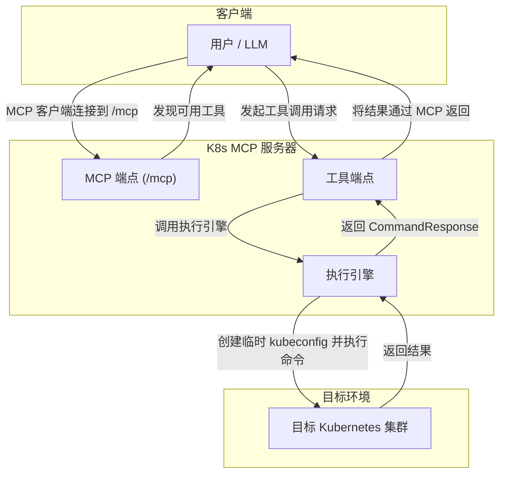

# K8s MCP 服务器

[](https://github.com/apecloud/mcp-k8s/actions/workflows/ci.yml)
[](https://github.com/apecloud/mcp-k8s/actions/workflows/release.yml)
[](https://codecov.io/gh/apecloud/mcp-k8s)
[](https://github.com/tadata-org/k8s-mcp-server/pkgs/container/k8s-mcp-server/versions)
[](https://github.com/tadata-org/k8s-mcp-server/pkgs/container/k8s-mcp-server)
[](https://pypi.org/project/k8s-mcp-server/)
[](https://github.com/apecloud/mcp-k8s/blob/main/LICENSE)

本项目是基于 [alexei-led/k8s-mcp-server](https://github.com/alexei-led/k8s-mcp-server) 的优秀工作。在此向原作者表示衷心的感谢！

K8s MCP 服务器是一个基于 `fastapi-mcp` 构建的、可通过网络访问的服务。它使 Claude 等大型语言模型 (LLM) 能够安全地运行 Kubernetes CLI 工具（`kubectl`, `istioctl`, `helm`, `argocd`）。它通过标准的模型控制协议（MCP）提供服务，并支持在每次请求中动态传入 `kubeconfig`，从而实现对多个 Kubernetes 集群的无缝管理。

## 核心特性

- **标准 MCP 实现**: 使用 `fastapi-mcp` 将 FastAPI 端点自动暴露为 MCP 工具，无需手动实现协议。
- **动态多集群支持**: 在每次 API 请求中直接以 Base64 编码的形式传入 `kubeconfig` 内容，无需预先配置或挂载文件。
- **独立的工具端点**: 每个 CLI 工具（`kubectl`, `helm` 等）都有自己专用的 HTTP 端点，结构清晰。
- **独立服务**: 可作为独立的 Docker 容器或在 Kubernetes 中运行。
- **自动 OpenAPI 文档**: 继承 FastAPI 的优势，自动生成并提供交互式 API 文档（通过 `/docs`）。

## 工作原理



## 快速入门

### 1. 运行 K8s MCP 服务器

使用 Docker 在本地快速启动服务器：

```bash
docker run -d --rm -p 9096:9096 --name mcp-server \
  docker.io/apecloud/k8s-mcp-server:latest
```
服务器现在正在 `http://localhost:9096` 上运行。您可以访问 `http://localhost:9096/docs` 查看所有可用的工具和其 API 文档。

### 2. 在 MCP 客户端中配置

对于任何支持 MCP 的客户端（如 `mcphost`、Cursor、Claude Desktop 等），请添加以下配置：

  ```json
  {
    "mcpServers": {
      "kubernetes": {
        "url": "http://localhost:9096/mcp"
      }
    }
  }
  ```
  *将 `localhost` 替换为 `k8s-mcp-server` 运行主机的 IP 地址（如果不在同一台机器上）。*

### 3. 开始使用

启动您的 MCP 客户端后，它将自动发现 K8s MCP 服务器提供的工具。现在您可以开始发出指令了。

- "使用 kubectl 工具，执行命令 `get pods -n default`。"
- "帮我检查 `prod` 命名空间中 `nginx-deployment` 的状态。"

## 本地开发与运行

### 1. 运行 K8s MCP 服务器

您可以使用 `Makefile` 中的 `quick-start` 命令在本地快速启动服务器：

```bash
make quick-start
```

这将构建 Docker 镜像并在本地运行容器，服务器将在 `http://localhost:9096` 上运行。

### 2. 验证服务器状态

一旦服务器启动，您可以通过以下 `curl` 命令验证其健康状态：

```bash
curl http://localhost:9096/health
```

如果服务器正常运行，您将收到一个成功的响应。

## 从源码运行

如果您希望从源码运行 K8s MCP 服务器，请遵循以下步骤：

### 1. 克隆仓库

如果您尚未克隆本项目的仓库，请先执行此操作：

```bash
git clone https://github.com/apecloud/mcp-k8s.git
cd mcp-k8s
```

### 2. 创建并激活虚拟环境

建议使用虚拟环境来管理项目依赖：

```bash
python3 -m venv .venv
source .venv/bin/activate
```

### 3. 安装依赖

安装项目所需的所有依赖：

```bash
pip install .
```

### 4. 运行服务器

使用 `uvicorn` 启动 FastAPI 应用程序：

```bash
uvicorn src.k8s_mcp_server.app:app --host 0.0.0.0 --port 9096
```

### 5. 验证服务器状态

服务器启动后，您可以使用以下 `curl` 命令验证其健康状态：

```bash
curl http://localhost:9096/health
```

如果服务器正常运行，您将收到一个成功的响应。

## API 使用示例 (Curl)

您可以直接通过 `curl` 与服务器的工具端点交互。

### Kubeconfig 认证方式

`kubeconfig` 信息可以通过两种主要方式提供：

1.  **通过 HTTP Header (`X-Kubeconfig`)**：
    *   将 Base64 编码的 `kubeconfig` 内容放在 `X-Kubeconfig` Header 中。
    *   **这种方式可以为大语言模型节约 Token 消耗**，因为 `kubeconfig` 不会作为请求体的一部分计入模型输入。

2.  **通过请求 Body (`kubeconfig` 字段)**：
    *   将 Base64 编码的 `kubeconfig` 内容作为 JSON 请求体中的 `kubeconfig` 字段值。

**示例：**

1.  将您的 `kubeconfig` 内容进行 Base64 编码：
    ```bash
    # macOS
    KUBECONFIG_B64=$(cat ~/.kube/config | base64)
    
    # Linux
    KUBECONFIG_B64=$(cat ~/.kube/config | base64 -w 0)
    ```

2.  **通过请求 Header (`X-Kubeconfig`) 发送请求：**
    ```bash
    curl -X POST http://localhost:9096/tools/kubectl \
      -H "Content-Type: application/json" \
      -H "X-Kubeconfig: $KUBECONFIG_B64" \
      -d @- << EOF
    {
      "command": "get pods -n default"
    }
    EOF
    ```

3.  **通过请求 Body 发送请求：**
    ```bash
    curl -X POST http://localhost:9096/tools/kubectl \
      -H "Content-Type: application/json" \
      -d @- << EOF
    {
      "command": "get pods -n default",
      "kubeconfig": "$KUBECONFIG_B64"
    }
    EOF
    ```
    
    您将收到一个 JSON 响应，其中包含命令执行的结果。

## 功能特性

-   **多种 Kubernetes 工具**：`kubectl`、`helm`、`istioctl` 和 `argocd`。
-   **云提供商原生支持**：由于 `kubeconfig` 是动态传入的，因此原生支持任何符合标准的 Kubernetes 集群，包括 AWS EKS、Google GKE 和 Azure AKS。
-   **安全性**：以非 root 用户在容器中运行。
-   **轻松配置**：通过环境变量进行简单配置。

## 文档

-   **API 文档**: 启动服务器后，请访问 `/docs` 路径以获取完整的交互式 API 文档。
-   **fastapi-mcp 文档**: [https://github.com/tadata-org/fastapi_mcp](https://github.com/tadata-org/fastapi_mcp)

## 贡献

我们欢迎社区的贡献！请随时提交问题和拉取请求。