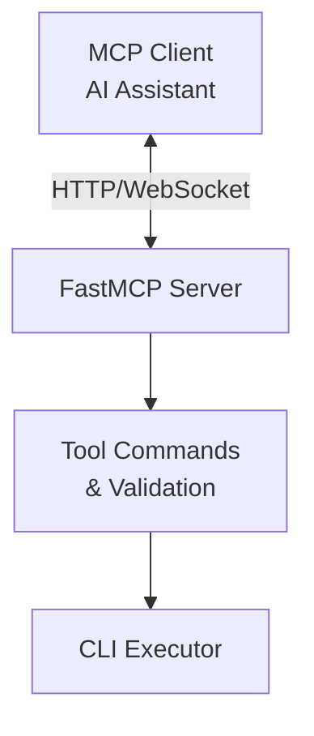

# Kubernetes MCP Server Specification

## Project Overview

The **Kubernetes MCP Server** provides a lightweight interface enabling AI assistants to execute Kubernetes CLI tools through the Model Context Protocol (MCP). This service bridges AI assistants like Claude Desktop with essential Kubernetes tooling (`kubectl`, `istioctl`, `helm`, `argocd`), allowing AI systems to help with Kubernetes deployments, configurations, troubleshooting, and optimization.

### Key Objectives

- **Command Documentation**: Provide detailed help information for Kubernetes CLI tools
- **Command Execution**: Execute commands for Kubernetes tools, returning raw results
- **MCP Compliance**: Fully implement the standard Model Context Protocol
- **Piped Commands**: Support Unix pipe operations to filter and transform command output
- **Secure Execution**: Execute commands with proper security measures
- **Tool Extensibility**: Maintain a design that easily accommodates new Kubernetes-related CLI tools
- **Consistent Output**: Preserve original tool output format for AI processing
- **Open Source**: Release under MIT license as a community resource

## Core Features

### 1. Tool-Specific Command Documentation

Each supported tool has a dedicated documentation function:

#### `describe_kubectl`
Retrieves help information for kubectl commands:

```json
{
  "name": "describe_kubectl",
  "description": "Get documentation and help text for kubectl commands",
  "parameters": {
    "command": {
      "type": "string",
      "description": "Specific command or subcommand to get help for (e.g., 'get pods')",
      "required": false
    }
  },
  "returns": {
    "help_text": "string",
    "status": "string",
    "error": "ErrorDetails | None"
  }
}
```

#### `describe_helm`
Retrieves help information for Helm commands.

#### `describe_istioctl`
Retrieves help information for Istio commands.

#### `describe_argocd`
Retrieves help information for ArgoCD commands.

**Example Usage:**
```
describe_kubectl({"command": "get pods"})
// Returns specific documentation for the kubectl get pods command
```

### 2. Tool-Specific Command Execution

Each supported tool has a dedicated execution function:

#### `execute_kubectl`
Executes kubectl commands:

```json
{
  "name": "execute_kubectl",
  "description": "Execute kubectl commands with support for Unix pipes",
  "parameters": {
    "command": {
      "type": "string",
      "description": "Complete kubectl command to execute (including any pipes and flags)",
      "required": true
    },
    "timeout": {
      "type": "integer",
      "description": "Maximum execution time in seconds (default: 300)",
      "required": false,
      "minimum": 1,
      "maximum": 1800
    }
  },
  "returns": {
    "status": "string",
    "output": "string",
    "exit_code": "integer (optional)",
    "execution_time": "number (optional)",
    "error": "ErrorDetails (optional)"
  }
}
```

#### `execute_helm`
Executes Helm commands.

#### `execute_istioctl`
Executes Istio commands.

#### `execute_argocd`
Executes ArgoCD commands.

**Example Usage:**
```
execute_kubectl({"command": "get pods -o json"})
// Returns JSON format output for pods

execute_helm({"command": "list", "timeout": 60})
// Lists all Helm releases with a 60-second timeout
```

### 3. AI-Driven Format Selection

The server relies on AI clients to specify output formats:

- AI clients are responsible for adding appropriate format flags (`-o json`, `-o yaml`, etc.)
- No automatic output format transformation by the server
- Raw command output is returned exactly as produced by the CLI tools
- AI clients can use pipe operators to process output as needed

**Examples:**
```
# JSON format for structured data processing
execute_kubectl({"command": "get pods -o json"})

# YAML format for configuration purposes
execute_kubectl({"command": "get deployment nginx -o yaml"})

# Wide output for human review
execute_kubectl({"command": "get pods -o wide"})
```

### 4. Context Management

The server provides capabilities for managing Kubernetes contexts:

- Support context switching through command parameters
- Clear error messages for authentication and context issues
- Support for multi-cluster environments
- Automatic context and namespace injection for kubectl and istioctl commands

**Examples:**
```
execute_kubectl({"command": "config use-context dev-cluster"})
// Switches to the dev-cluster context

execute_kubectl({"command": "config get-contexts"})
// Lists all available contexts

execute_kubectl({"command": "--context=prod-cluster get pods"})
// Runs the command against the prod-cluster without changing the default context
```

### 5. Command Piping

Support for Unix command piping enhances functionality:

- Standard Unix utilities can be piped with Kubernetes commands
- Common filtering tools are supported (`grep`, `awk`, `sed`, etc.)
- Data manipulation tools like `jq` and `yq` are available

**Supported Unix Commands:**
- Text processing: `grep`, `sed`, `awk`, `cut`, `sort`, `uniq`, `wc`, `head`, `tail`
- Data manipulation: `jq`, `yq`, `xargs`
- File operations: `ls`, `cat`, `find`
- And many other standard Unix utilities

**Examples:**
```
execute_kubectl({"command": "get pods -o json | jq '.items[].metadata.name'"})
// Extracts just the pod names from JSON output

execute_kubectl({"command": "get pods | grep Running | wc -l"})
// Counts the number of running pods
```

### 6. Tool Extension Approach

The server follows a standard pattern for adding new Kubernetes-related CLI tools:

- Consistent interface design across all supported tools
- Well-defined parameter patterns and return formats
- Standardized error handling

**Tool Configuration Principles:**
- Each tool must define its allowed commands
- Each tool provides its own documentation function
- Each tool provides its own execution function

### 7. Prompt Templates

The server provides a collection of prompt templates for common Kubernetes operations:

- Resource status checking
- Application deployment
- Troubleshooting
- Resource inventory
- Security analysis
- And other common operational tasks

**Available Prompt Templates:**
- `k8s_resource_status`: Check status of Kubernetes resources
- `k8s_deploy_application`: Deploy an application to Kubernetes
- `k8s_troubleshoot`: Troubleshoot Kubernetes resources
- `k8s_resource_inventory`: List all resources in cluster
- `istio_service_mesh`: Manage Istio service mesh
- `helm_chart_management`: Manage Helm charts
- `argocd_application`: Manage ArgoCD applications
- `k8s_security_check`: Security analysis for Kubernetes resources
- `k8s_resource_scaling`: Scale Kubernetes resources
- `k8s_logs_analysis`: Analyze logs from Kubernetes resources

**Example Usage:**
```
k8s_resource_status(resource_type="pods", namespace="default")
// Generates a prompt for checking pod status in the default namespace
```

## Architecture

### Component Overview

The Kubernetes MCP Server consists of these logical components:



### Component Responsibilities

1. **FastMCP Server**
   - Implements MCP protocol endpoints
   - Handles tool requests and responses
   - Manages client connections
   - Registers prompt templates

2. **Tool Commands & Validation**
   - Processes documentation requests
   - Processes execution requests
   - Validates commands against security policies
   - Validates parameters and formats responses

3. **CLI Executor**
   - Executes CLI commands securely
   - Captures standard output and error streams
   - Handles timeouts
   - Injects context and namespace when appropriate

### Security Model

Security principles for the Kubernetes MCP Server include:

1. **Command Validation**
   - Allowlist-based approach for permitted commands
   - Validation of all command inputs against injection attacks
   - Pipe chain validation for authorized utilities only
   - Specific validation for potentially dangerous commands like `kubectl exec`

2. **Execution Security**
   - Execution timeouts to prevent resource exhaustion
   - Proper handling of command errors and timeouts
   - Secure subprocess execution

3. **Authentication Security**
   - Basic detection of authentication errors
   - Appropriate error messages for authentication issues
   - No storage of sensitive credentials

### Error Handling Framework

A consistent error handling approach ensures clear communication:

1. **Error Categories**
   - Command validation errors
   - Authentication errors
   - Execution errors
   - Timeout errors
   - Internal system errors

2. **Standard Error Format**
   ```typescript
   type ErrorDetailsNested = {
     command?: string;
     exit_code?: number;
     stderr?: string;
   };

   type ErrorDetails = {
     message: string;
     code: string;
     details?: ErrorDetailsNested;
   };

   type CommandResult = {
     status: "success" | "error";
     output: string;
     exit_code?: number;
     execution_time?: number;
     error?: ErrorDetails;
   };
   ```

3. **Common Error Messages**
   - Invalid tool: "Tool not found. Available tools: kubectl, helm, istioctl, argocd."
   - Restricted command: "Command is restricted for security reasons."
   - Context errors: "Context not found in kubeconfig. Available contexts: [list]."
   - Timeout errors: "Command timed out after N seconds."

### Configuration Principles

Configuration for the Kubernetes MCP Server follows these principles:

1. **Core Configuration Areas**
   - Server settings (host, port, logging)
   - Tool settings (paths, allowed commands)
   - Security settings (restrictions, allowed pipes)
   - Timeout settings (default and maximum)
   - Context and namespace settings

2. **Configuration Layering**
   - Default sensible configurations built-in
   - Configuration overrides through environment variables
   - Environment-specific settings

## Conclusion

This Kubernetes MCP Server specification outlines a focused approach to providing Kubernetes CLI capabilities to AI assistants through the Model Context Protocol. By emphasizing clean interfaces, security, and flexibility, the specification supports a system that can serve as a bridge between AI assistants and Kubernetes environments.

The design prioritizes tool-specific commands rather than generic interfaces, enabling clearer usage patterns and more robust parameter validation. The security model focuses on principles rather than implementation details, allowing for various secure implementations. The error handling framework ensures consistent and clear communication of issues to clients.

Additional features like automatic context/namespace injection and prompt templates enhance the usability and value of the server for AI assistant interactions with Kubernetes environments.
